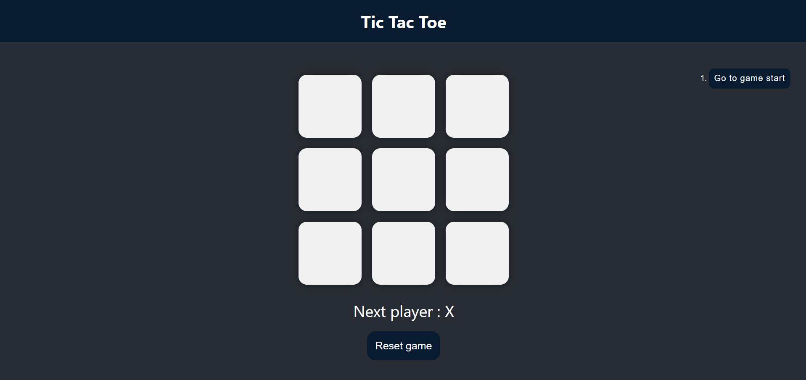

# 🎮 Tic Tac Toe Game

A clean and interactive **Tic Tac Toe** game built using **React**. <br />
This project is my first hands-on React application, inspired by the official **React.dev** tutorial. I previously built this game using **vanilla JavaScript**, and recreating it in React helped me understand component structure, props, state management, and time-travel debugging.

---

## 📸 Screenshots



---

## 🌐 Live Demo

Check out the live version of the project here: [Tic Tac Toe Game](https://tic-tac-toe-react-mu-rust.vercel.app/)

---

## ✨ Features

- 🎯 Classic Tic Tac Toe gameplay
- ⚛️ Built using modular React components
- 📱 Fully responsive across devices
- 🔁 Restart & New Game functionality
- ⏪ Time Travel — navigate through the history of moves
- 🎉 Visual highlights for winner & ended games

---

## 🛠️ Technologies Used

- React.js
- HTML
- CSS (Plain CSS for styling)

---

## 🛠️ Installation

1️⃣ Clone the repository

```bash
git clone https://github.com/TonyStark-19/Tic-Tac-Toe-React.git
```

2️⃣ Move into the project directory

```bash
cd Tic-Tac-Toe-React
```

3️⃣ Install dependencies

```bash
npm install
```

4️⃣ Start the development server

```bash
npm start
```

The app will be running on `http://localhost:3000`

---

## 🎮 How to Play

1. Visit the Game [here](https://tic-tac-toe-react-mu-rust.vercel.app/).
2. Player X starts the game.
3. Players take turns clicking cells on the 3×3 board.
4. First to get three in a row (horizontal, vertical, or diagonal) wins.
5. If all cells are filled with no winner → Match Draw.
6. Use the Restart button to start a fresh game.
7. Use Time Travel to jump back to any previous move in history.

---

## 📌 What I Learned

- Managing UI using React components
- Using state to track gameplay
- Implementing immutable updates
- Rendering lists dynamically
- Managing time travel using stored history
- Understanding React’s core concepts more deeply

---

## 🤝 Contribution

Feel free to fork this repository and contribute to enhance the project. 😊

---

💙 Acknowledgements

Inspired by the official [React documentation](www.react.dev) tutorial
Deployed using Vercel

---

💡 Built with React and enthusiasm by **Aditya Chandel**
